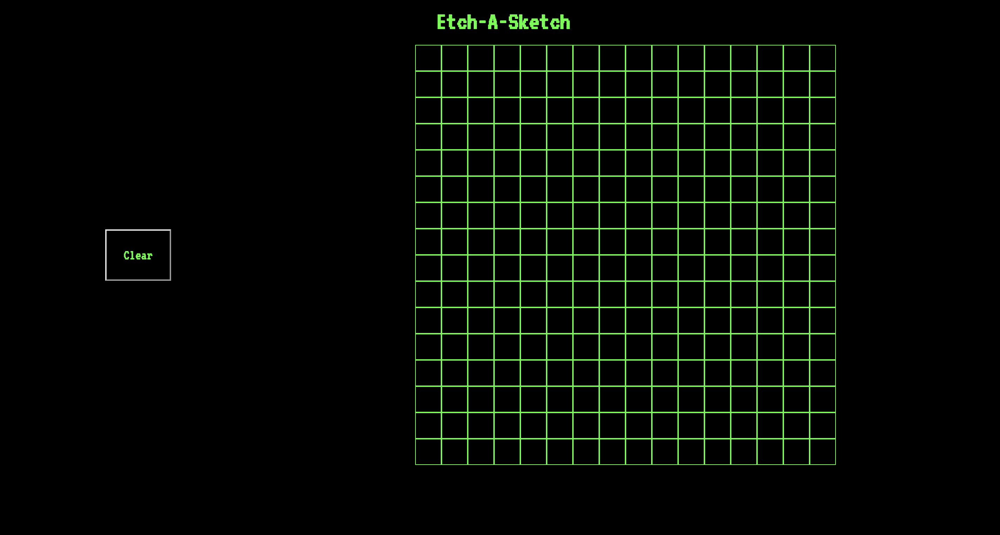

# Etch-A-Sketch

Etch-A-Sketch is a JavaScript project that uses CSS Grid and DOM manipulation to create a simple sketch application in the browser. It is based on the Etch-A-Sketch assignment from The Odin Project

## Usage

Drag the cursor over the canvas to draw. Press the clear button to empty the canvas and set a custom cell density for you new canvas.

## Image

## Live

https://hearn-dev.github.io/etch_a_sketch/
